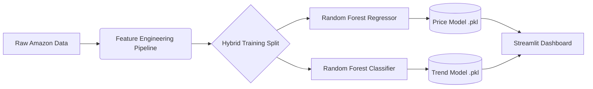

# 📈 Amazon_Sales_Trend_Analysis_AI: Dual-Engine AI Forecasting

  

This is a professional end-to-end Machine Learning project that forecasts weekly Amazon sales. It tackles the challenge of **intermittent demand** (sporadic, massive sales spikes) using a hybrid AI architecture.

**📊 Live Dashboard:** https://amazonsalestrendanalysisai-urmatsgvbpmnhdsq6j6yfi.streamlit.app/


---

## 📋 Table of Contents
- [Overview](#-overview)
- [Key Features](#-key-features)
- [System Architecture](#-system-architecture)
- [Project Structure](#-project-structure)
- [Model Performance](#-model-performance)
- [Quick Start](#-quick-start)

## 🎯 Overview
Retail data is messy. Products like "Baby Food" or "Cereal" might have zero sales for weeks and then suddenly generate $1.7 Million in a single week. Standard forecasting models fail here, often predicting a safe, flat average.

This project solves that problem by deploying two specialized AI models simultaneously:
1.  **The Trend Analyzer:** A classifier that predicts market direction (High vs. Low) with extreme accuracy.
2.  **The Spike Hunter:** A regressor tuned aggressively to capture massive revenue spikes, rather than playing it safe.

## ✨ Key Features

### 🔧 Retail-Specific Feature Engineering
Raw transaction data is transformed into powerful time-series signals:
* **Lag Decomposition:** Captures historical performance (Sales last week, last month).
* **Momentum Indicators:** Calculates week-over-week growth rates to detect accelerating trends.
* **Rolling Volatility:** Measures stability versus erratic behavior over a 4-week window.

### 🤖 Dual-Model AI (Random Forest)
We pivoted from XGBoost to **Random Forest** because it proved superior at memorizing and predicting extreme, non-linear sales spikes present in this specific dataset.
* **Model A (Regression):** Predicts exact dollar amounts, optimized for capturing million-dollar outliers.
* **Model B (Classification):** Predicts a binary "High Growth" vs "Low Growth" status based on category medians.

### 📊 Interactive Executive Dashboard
A Streamlit interface allows stakeholders to:
* Select specific product categories.
* Visualize the AI's forecast line against actual historical sales.
* See real-time metrics on the current week's predicted revenue and market trend status.

## 🧠 System Architecture


## 📁 Project Structure
```
Amazon_Sales_Trend_Analysis_AI/
│
├── 📂 data/
│   ├── 📂 raw/              # Original Amazon Sales CSV
│   └── 📂 processed/        # Cleaned, weekly aggregated data with features
│
├── 📂 models/
│   ├── price_model.pkl      # Trained Regression Model
│   └── trend_model.pkl      # Trained Classification Model
│
├── 📂 src/
│   ├── __init__.py
│   ├── data_loader.py       # Initial data cleaning
│   ├── features.py          # Time-series feature generation
│   └── train.py             # Trains and saves both AI models
│
├── 📂 app/
│   └── dashboard.py         # The interactive frontend
│
├── README.md                # Project documentation
└── requirements.txt         # Python dependencies
```

## 📊 Model Performance

| Model | Objective | Metric | Result | Status |
| :--- | :--- | :--- | :--- | :--- |
| **Trend Classifier** | Market Direction | Accuracy | **97.22%** | 🟢 Production Ready |
| **Sales Regressor** | Revenue Forecasting | MAE | **~$66,000** | 🟡 Aggressively Tuned |

*> **Note on Regression Error:** The MAE of $66k is intentional. Early models achieved a lower error (~$7k) by conservatively predicting near-zero values. The current model is tuned aggressively to attempt predicting million-dollar spikes.*

## 🔗 Contributors

* **Aditi Saha:** Project development, ML pipeline, Concepts discussion
* **Anurag Thakur:** Dataset understanding, Dashboard, Model review